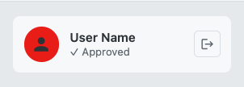
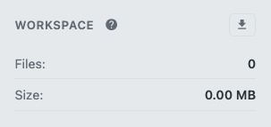
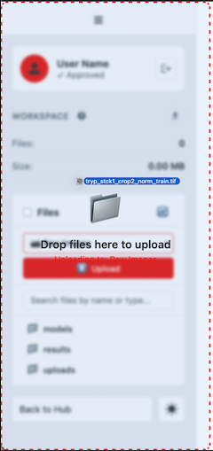
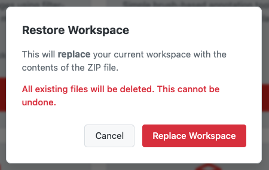
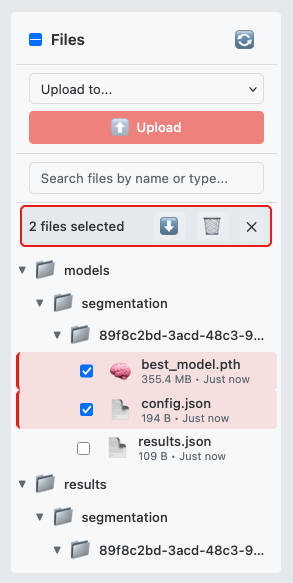
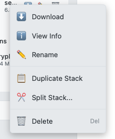
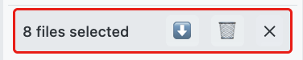
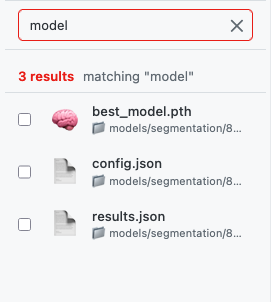
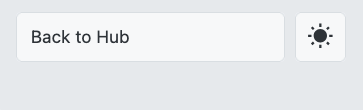

# File Browser Guide

The File Browser is your central hub for managing all files in your workspace. This guide covers the complete left sidebar, including user information, workspace controls, file management, and navigation.


*Caption: The workspace sidebar showing user info, workspace controls, file browser, and navigation*

---

## Quick Start

1. **Select a category** — Choose a file type from the category dropdown (Raw Images, Annotations, etc.)
2. **Upload files** — Click the upload button or drag-and-drop files onto the sidebar
3. **Navigate files** — Click folder arrows to expand/collapse, click files to select
4. **Perform actions** — Right-click any file for the context menu with download, rename, and delete options
5. **Use batch operations** — Select multiple files with checkboxes, then download as ZIP or delete in bulk

---

## Detailed Guide

### Sidebar Overview

The left sidebar contains the File Browser along with user information, workspace controls, and navigation. Here's the complete layout from top to bottom:


| Section | Description |
|---------|-------------|
| **User Info** | Your name, account status, and logout button |
| **Workspace Info** | Help icon, download button, and workspace statistics |
| **File Browser** | Upload controls, search, and file tree |
| **Sidebar Footer** | Navigation and theme controls |

---

### User Info Section

At the top of the sidebar, you'll find your account information:



| Element | Description |
|---------|-------------|
| **User Name** | Your full name as registered |
| **Account Status** | Shows your approval status (Pending, Active, etc.) |
| **Logout Button** | Click to sign out and return to the welcome page |

> **Note:** Users with "Pending" status can explore the workspace and use test data, but cannot upload custom files until approved by an administrator.

---

### Workspace Info Section

Below the user info, you'll find workspace controls and statistics:



| Element | Description |
|---------|-------------|
| **Help Icon** | Opens the Help & Info panel with documentation and glossary |
| **Download Workspace** | Downloads your entire workspace as a ZIP archive |
| **Files** | Total number of files in your workspace |
| **Size** | Total size of all files in your workspace |

#### Download Workspace Button

Click this button to export your entire workspace:
- Creates a ZIP archive of all your files
- Includes uploads, results, and models
- Excludes cache directories (thumbnails, slices)
- Useful for backup or transferring to another session

> **Tip:** Export your workspace before major experiments to create a restore point.

---

### File Browser Section

The main file management area with upload controls, search, and file tree:


| UI Area | Description |
|---------|-------------|
| **Header** | Contains the refresh button and "Select All" checkbox |
| **Category Dropdown** | Select the type of file you want to upload |
| **Upload Button** | Triggers file upload (enabled after selecting category) |
| **Search Bar** | Filter files by name, type, or category |
| **File Tree** | Hierarchical view of all workspace folders and files |
| **Batch Toolbar** | Appears when files are selected; provides bulk operations |

#### Uploading Files

Files must be uploaded with a category designation. The category determines where files are stored and how they can be used.

**Step 1: Select a Category**

Click the category dropdown and choose from:

| Category | Accepted Files | Purpose |
|----------|----------------|---------|
| **Raw Images** | `.tif`, `.tiff` | Training data or inference input images |
| **Annotations** | `.tif`, `.tiff` | Segmentation masks/labels for training |
| **Inference Data** | `.tif`, `.tiff` | Images to run inference on |
| **Model Files** | `.pth`, `.json` | Pre-trained model weights and config |
| **Restore Workspace** | `.zip` | Restore a previously exported workspace |

**Step 2: Upload Files**

*Option A: Click Upload*
1. Click the upload button (enabled after selecting category)
2. Select one or more files from the file dialog
3. Watch the progress bar as files upload

*Option B: Drag and Drop*
1. Select a category first (required)
2. Drag files from your computer onto the sidebar
3. The drop zone highlights when files are over it
4. Release to begin upload



**Upload Progress**

During upload, you'll see:
- A progress bar filling as each file uploads
- Text showing: "Uploading X of Y: filename"
- A success notification when complete

> **Note:** Maximum file size is 200MB per file. Account approval is required to upload custom files—pending users can only use test data.

#### Restore Workspace from ZIP

Replace your current workspace with a previously exported one.

1. Select "Restore Workspace" from the category dropdown
2. Select the ZIP file to upload
3. **Read the warning**: This will delete all current files
4. Click "Replace Workspace" to confirm
5. Wait for extraction and restoration to complete



> **Warning:** Restore completely replaces your workspace. All existing files will be deleted. Export your current workspace first if needed.

#### Navigating the File Tree

Files are organized in a hierarchical folder structure:

```
uploads/
  ├── raw/           → Raw image stacks
  └── annotations/   → Annotation masks
results/
  ├── segmentation/  → Segmentation outputs
  └── denoised/      → Denoised images
models/
  └── [session]/     → Trained models
```

**Expanding and Collapsing Folders**

- Click the **arrow** (▶) next to a folder to expand it
- Click again (▼) to collapse
- Folders are sorted before files, alphabetically within each category

**Selecting Files**

- **Single file**: Click the checkbox next to any file
- **Multiple files**: Click checkboxes on multiple files
- **Select all**: Click the "Select All" checkbox in the header
- **Clear selection**: Click the ✕ button in the batch toolbar



#### File Information Display

Each file in the tree shows:

| Element | Description |
|---------|-------------|
| **Checkbox** | For selecting the file |
| **Thumbnail/Icon** | Preview image for TIFF files, or type icon |
| **Filename** | Full name with extension |
| **Size** | Formatted file size (KB, MB, GB) |
| **Date** | Relative time ("5 minutes ago", "2 days ago") |
| **Category Tags** | Badges showing file type (training, inference, etc.) |
| **NEW Badge** | Appears briefly on newly uploaded files |

**Thumbnail Previews**

TIFF, PNG, and JPG files display thumbnail previews instead of icons. Thumbnails are generated on-demand and cached for performance.

#### Single File Operations

Right-click any file to open the context menu:



**Download**

- **How**: Right-click → Download, or click the ⬇️ button
- **Result**: File downloads to your browser's default download location

**Rename**

- **How**: Right-click → Rename
- **Dialog**: Enter the new filename (extension must stay the same)
- **Validation**: Cannot change file extension

> **Tip:** Use descriptive names that include the processing step or date for easier organization.

**Delete**

- **How**: Right-click → Delete
- **Confirmation**: A dialog asks "Delete 'filename'? This action cannot be undone."
- **Result**: File is permanently removed

**View File Info**

- **How**: Right-click → View Info
- **Modal displays**:
  - Filename and full path
  - File size and category
  - Upload timestamp
  - File ID (for technical reference)
  - **Processing History**: Shows the lineage chain of how this file was created


#### TIFF Stack Operations

TIFF stacks have additional operations available in the context menu:

**Duplicate Stack**

Creates an exact copy of the TIFF stack.

- **How**: Right-click → Duplicate Stack
- **Result**: New file created as `originalname_copy.tif`
- **Use case**: Create a backup before processing, or create variants

**Split Stack**

Divides a multi-slice TIFF into two separate files.

- **How**: Right-click → Split Stack... (only available for stacks with >1 slice)
- **Dialog**:
  - Enter the split point (slice number)
  - Preview shows resulting slice ranges
  - Option to delete original after split
- **Result**: Creates `originalname_part1.tif` and `originalname_part2.tif`


> **Tip:** Use Split Stack to separate a Z-stack into regions of interest, or to create smaller test datasets.

#### Batch Operations

When one or more files are selected, the batch toolbar appears:



| Button | Action |
|--------|--------|
| **Download as ZIP** (⬇️) | Downloads all selected files as a single ZIP archive |
| **Delete Selected** (🗑️) | Deletes all selected files (with confirmation) |
| **Clear Selection** (✕) | Deselects all files |

**Batch Download**

1. Select the files you want to download
2. Click the download button in the batch toolbar
3. Wait for "Preparing download..." to complete
4. ZIP file downloads as `workspace_files.zip`

**Batch Delete**

1. Select the files you want to delete
2. Click the delete button in the batch toolbar
3. Confirm the deletion in the dialog
4. Files are permanently removed

> **Warning:** Batch delete cannot be undone. Double-check your selection before confirming.

#### Search and Filtering

The search bar filters files in real-time as you type.



**Search Features**

- **Real-time**: Results update as you type (300ms delay for performance)
- **Multi-word**: Separate words with spaces to search for any match (OR logic)
- **Clear**: Click the ✕ button to clear the search

**What Search Matches**

| Search Type | Example | Matches |
|-------------|---------|---------|
| **Filename** | `training` | Any file with "training" in the name |
| **Category** | `seg` | Files in "segmentation_results" category |
| **Keywords** | `mask` | Files categorized as annotations |
| **Type** | `model` | Model files (.pth) |

**Category Keywords:**
- Raw images: `raw`, `image`, `training`, `input`
- Annotations: `annotation`, `mask`, `label`
- Models: `model`, `pth`, `weights`, `checkpoint`
- Segmentation: `segmentation`, `result`, `output`
- Denoised: `denoise`, `clean`
- Meshes: `mesh`, `3d`, `surface`

**Search Results View**

When searching, the file tree switches to a flat list view showing:
- File icon/thumbnail
- Filename
- Directory path (📁 path/to/file)
- Result count

---

### Sidebar Footer

At the bottom of the sidebar are navigation and display controls:



| Element | Description |
|---------|-------------|
| **Back to Hub** | Returns to the workspace hub (module selection screen) |
| **Theme Toggle** | Switches between light and dark display modes |

#### Back to Hub Button

Click "Back to Hub" to:
- Exit the current module
- Return to the workspace hub
- View all available modules
- Access a different processing workflow

#### Theme Toggle

Switch between light and dark modes:
- **Light Mode**: Bright background, ideal for well-lit environments
- **Dark Mode**: Dark background, reduces eye strain in low light
- Your preference is saved and persists across sessions

---

### Keyboard Shortcuts

| Shortcut | Action |
|----------|--------|
| **ESC** | Close open dialogs (file info, split dialog, context menu) |
| **Tab** | Navigate between interactive elements |
| **Enter** | Confirm dialogs |

---

## Troubleshooting

| Issue | Cause | Solution |
|-------|-------|----------|
| Upload button disabled | No category selected | Select a category from the dropdown first |
| "Account approval required" error | Pending user status | Wait for admin approval or use test data |
| File not appearing after upload | Display not refreshed | Click the refresh button (🔄) |
| Can't rename file | Extension mismatch | Keep the same file extension |
| Drag-and-drop not working | No category selected | Select a category before dragging files |
| Split Stack not available | Single-slice TIFF | Option only appears for multi-slice stacks |
| Search not finding file | Spelling or category | Try different keywords or clear search |

---

## Related Help Articles

- [Getting Started with Help](info:getting-started) — Overview of the help system
- [Quick Annotation Tool](info:annotation) — Creating annotation files for training
- [Raw Training Images](info:segmentation.step1.raw-images) — Requirements for training image data
- [File Upload](info:file-browser.upload) — Uploading files to the workspace
- [File Categories](info:file-browser.categories) — Understanding file organization

---

## Next Steps

After organizing your files, you can:
- **Train a model** — Use the Segmentation module with your uploaded training data
- **Run inference** — Apply a trained model to your inference images
- **Denoise images** — Clean up noisy data before analysis
- **Create annotations** — Use the Annotation module to label your images

---

*Written for Workspace Version 1.0.0*
