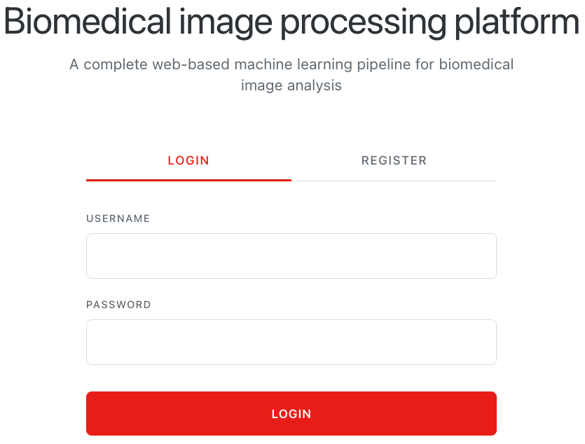
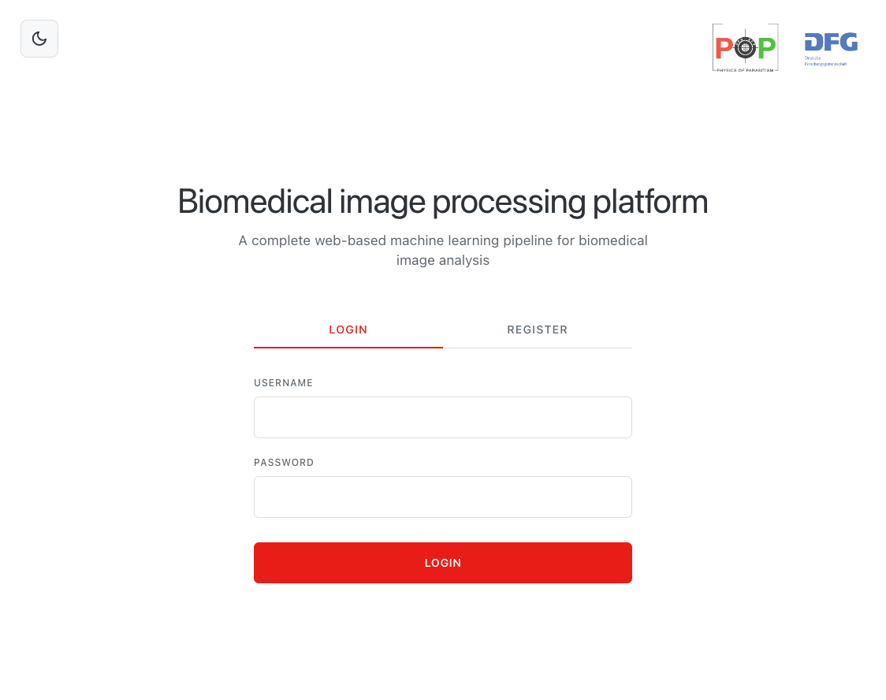
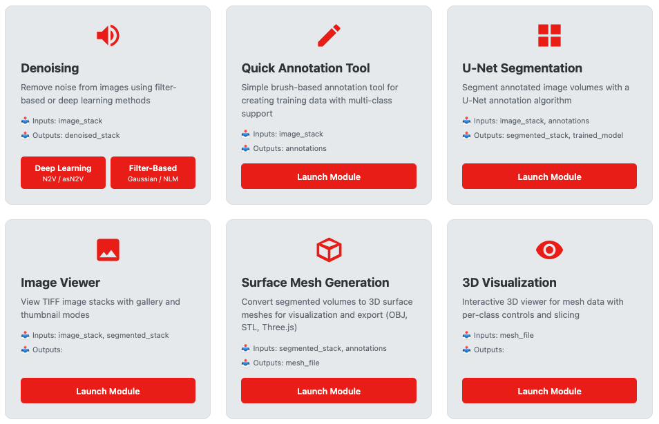
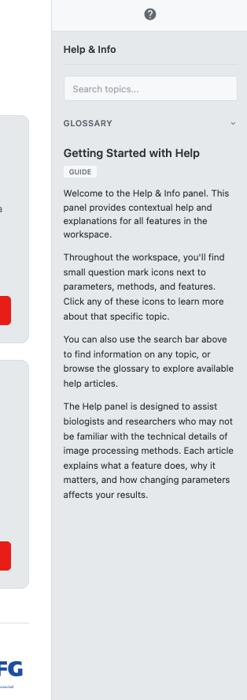
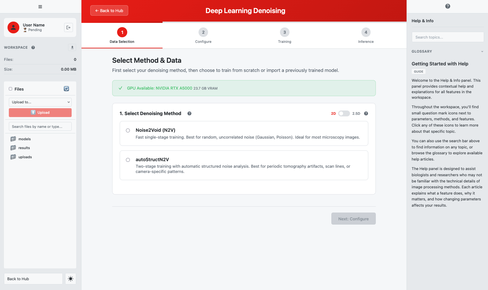

# Getting Started

Welcome to the Biomedical Image Processing Workspace. This guide walks you through account setup, the workspace interface, and basic navigation.

*The welcome page with login and registration options*

---

## Overview

The workspace provides a complete environment for biomedical image analysis:

- **Segmentation** — Train U-Net models to identify structures in microscopy images
- **Denoising** — Remove noise using deep learning (N2V, autoStructN2V) or filters
- **Annotation** — Create training data with brush-based labeling tools
- **Mesh Generation** — Convert segmentation results to 3D surface meshes
- **Visualization** — Explore 3D meshes interactively
- **Image Viewing** — Browse and inspect TIFF stacks

---

## Account Setup

### Registration

To create an account, click the **Register** tab on the welcome page.

**Required Fields:**

| Field | Requirements |
|-------|--------------|
| **Username** | 3-20 characters, letters, numbers, and underscores only |
| **Email** | Valid email address |
| **Password** | Minimum 8 characters |
| **Confirm Password** | Must match password |
| **Full Name** | Your name (displayed in workspace) |
| **Institution** | Your university, research institute, or organization |

After submitting, your account is created with **pending** status.

### Account Approval Workflow

New accounts require administrator approval for full access:

| Status | What You Can Do |
|--------|-----------------|
| **Pending** | Log in, explore the workspace, use built-in test data, train models and run inference with test data |
| **Active** | Full access: upload custom files, import models, all features |
| **Rejected** | Cannot log in (contact administrator) |

> **Note:** You can start using the workspace immediately with test data while waiting for approval. You'll be notified once your account is approved for custom uploads.

### Login

Enter your username and password on the **Login** tab. After successful login:
- **New users**: Redirected to the workspace
- **Returning users**: See "Welcome back" message with "Launch Workspace" button

---

## Welcome Page

The welcome page is your entry point to the application.

*Welcome page elements*

### For New/Logged-Out Users

| Element | Location | Description |
|---------|----------|-------------|
| **Login Tab** | Center | Enter credentials to access workspace |
| **Register Tab** | Center | Create a new account |
| **Theme Toggle** | Top-left | Switch between light and dark mode |
| **Partner Logos** | Top-right | Physics of Parasitism and DFG logos |

### For Logged-In Users

| Element | Description |
|---------|-------------|
| **Welcome Message** | "Welcome back, [Your Name]" |
| **Launch Workspace** | Button to enter the main workspace |
| **Logout** | End your session |
| **Admin Dashboard** | Link to admin panel (administrators only) |

---

## Workspace Layout

The workspace uses a three-panel layout:

*The main workspace interface*

### Left Sidebar

The sidebar provides workspace controls and navigation.

#### User Info Section

| Element | Description |
|---------|-------------|
| **Avatar** | User icon |
| **Name** | Your full name or username |
| **Status Badge** | "Approved" or "Pending" |
| **Logout Button** | Exit icon to end session |

#### Workspace Section

| Element | Description |
|---------|-------------|
| **"Workspace" Header** | With help icon (click for documentation) |
| **Download Button** | Download entire workspace as ZIP |
| **Stats** | File count and total size |

#### File Browser Section

Browse and manage files in your workspace. See the [File Browser Guide](file-browser.md) for details.

#### Sidebar Footer

| Element | Description |
|---------|-------------|
| **Back to Hub** | Return from a module to the main view |
| **Theme Toggle** | Sun/moon icon for light/dark mode |

#### Sidebar Toggle

Click the hamburger menu (three lines) at the top-left to collapse or expand the sidebar.

---

### Main Content Area (Hub)

The hub displays available processing modules as cards in a grid.

*Module cards in the workspace hub*

#### Module Card Anatomy

Each card contains:

| Element | Description |
|---------|-------------|
| **Icon** | Visual identifier for the module |
| **Name** | Module title (e.g., "U-Net Segmentation") |
| **Description** | Brief explanation of functionality |
| **Inputs/Outputs** | What data the module accepts and produces |
| **Launch Button** | Click to enter the module |
| **Help Icon** | Question mark — opens help panel for this module |

#### Available Modules

| Module | Description |
|--------|-------------|
| **U-Net Segmentation** | Train models and segment images |
| **Denoising** | Remove noise (offers two options: Deep Learning or Filter-Based) |
| **Quick Annotation Tool** | Create training annotations with brush tools |
| **Image Viewer** | Browse TIFF stacks in gallery or thumbnail view |
| **Surface Mesh Generation** | Convert segmentation to 3D meshes |
| **3D Visualization** | Interactive mesh viewer |

> **Special:** The Denoising card shows two launch buttons side-by-side: "Deep Learning" (N2V/autoStructN2V) and "Filter-Based" (Gaussian/NLM).

---

### Right Info Panel (Help System)

The help panel provides documentation and guidance.

*The help panel with search, glossary, and articles*

#### Opening the Help Panel

- Click the **?** toggle button on the right edge of the screen
- Or click any **help icon** throughout the interface

#### Help Panel Features

| Tab | Description |
|-----|-------------|
| **Search** | Full-text search across all articles |
| **Glossary** | Alphabetical terminology definitions |
| **Article View** | Detailed documentation on selected topic |

For more details, see the [Help Navigation Guide](help-navigation.md).

---

## Navigation

### Launching a Module

1. Find the module card in the hub
2. Click **Launch Module** (or the specific option for Denoising)
3. The hub view hides and the module interface appears
4. Follow the step-by-step workflow within the module

*Inside a module with step navigation*

### Step Navigation

Most modules guide you through steps:

| Element | Description |
|---------|-------------|
| **Step Indicators** | Shows current step and progress |
| **Next/Previous Buttons** | Navigate between steps |
| **Step Content** | Current step's interface |

### Returning to Hub

To exit a module and return to the main hub:

1. Click **Back to Hub** in the sidebar footer
2. The module closes and the hub reappears
3. Your progress may be saved depending on the module

---

## Theme Toggle

Switch between light and dark mode:

1. Click the **sun/moon icon** in the sidebar footer
2. The interface updates immediately
3. Your preference is saved and persists across sessions

| Mode | Description |
|------|-------------|
| **Light** | White background, dark text (default) |
| **Dark** | Dark background, light text |

---

## Quick Reference

### Keyboard Shortcuts

The workspace primarily uses mouse/touch navigation. Module-specific shortcuts are documented in each module guide.

### Key Locations

| Action | Location |
|--------|----------|
| **Logout** | Sidebar → User Info section |
| **Download Workspace** | Sidebar → Workspace section |
| **Return to Hub** | Sidebar → Footer |
| **Theme Toggle** | Sidebar → Footer |
| **Open Help** | Right edge toggle or any help icon |
| **Launch Module** | Hub → Module card |

---

## Next Steps

Now that you're familiar with the workspace:

- **Upload data** — Learn about the [File Browser](file-browser.md) for managing files
- **Read best practices** — See [Best Practices](best-practices.md) for data preparation and tips
- **Start processing** — Choose a module guide:
  - [Segmentation](modules/segmentation.md) — Train U-Net models
  - [DL Denoising](modules/denoising-dl.md) — Deep learning noise removal
  - [Filter Denoising](modules/denoising-filter.md) — Quick filter-based denoising
  - [Annotation](modules/annotation.md) — Create training labels
  - [Image Viewer](modules/imageviewer.md) — Browse your images

---

*Written for Workspace Version 1.0.0*
