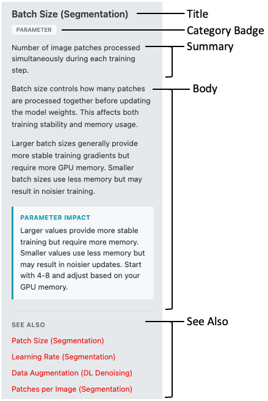

# Help & Info Panel Guide

The Help & Info panel provides access to documentation, terminology definitions, and contextual help throughout the workspace. This guide covers how to navigate and find information using the search bar, glossary, and cross-reference links.

*Caption: The Help & Info panel with search bar, glossary, and article display*

---

## Quick Start

1. **Open the panel** — Click the help icon (?) in the workspace info section or any inline help icon
2. **Search for topics** — Type in the search bar to find articles by title, tag, or category
3. **Browse the glossary** — Click "Glossary" to expand alphabetical term listings
4. **Follow cross-references** — Click "See Also" links at the bottom of articles to explore related topics

---

## Detailed Guide

### Opening the Help Panel

There are two ways to access the Help & Info panel:

#### Workspace Help Icon

Click the help icon (?) in the Workspace Info section of the sidebar to open the panel. Click again to collapse it.

| State | Panel Width | Content |
|-------|-------------|---------|
| **Collapsed** | 48px | Icon only visible |
| **Expanded** | 280px | Full panel with search, glossary, and articles |

#### Context-Sensitive Help Icons

Throughout the workspace, you'll find small help icons next to parameters, settings, and features. These icons have a `?` symbol and appear inline with labels.

- **Hover** over an icon to see a tooltip
- **Click** the icon to open the help panel directly to that topic's article

> **Tip:** Context-sensitive help icons are the fastest way to get information about a specific parameter or feature while you're working.

---

### Using the Search Bar

The search bar is the primary way to find information in the help system.

#### How to Search

1. Click in the search input field (placeholder: "Search topics...")
2. Type at least 2 characters
3. Results appear automatically after a brief delay
4. Click any result to view the article

#### What Gets Searched

| Search Target | Example Query | What It Finds |
|---------------|---------------|---------------|
| **Article titles** | `patch size` | Articles with "patch" or "size" in the title |
| **Tags** | `training` | Articles tagged with "training" |
| **Categories** | `parameter` | Articles categorized as parameters |

> **Note:** The search looks at article metadata (titles, tags, categories), not the full text content of articles.

#### Search Results

- Up to **15 results** are displayed
- Results show the article title and category badge
- Your search query is highlighted in the results
- Results are sorted by relevance

#### Clearing the Search

- Click the **×** button to clear your search
- Click outside the results dropdown to close it
- Results automatically close when you select an article

---

### Browsing the Glossary

The glossary provides an alphabetical listing of all terms and concepts in the help system.

#### Opening the Glossary

1. Locate the "Glossary" header below the search bar
2. Click to expand (smooth animation reveals the term list)
3. Click again to collapse

#### Navigating Terms

Terms are organized alphabetically by first letter:

- **Letter sections** (A, B, C, etc.) group related terms
- **Scroll** through the list to browse (max height with scrollbar)
- **Hover** over a term to highlight it
- **Click** a term to view its associated article

#### What's in the Glossary

Each glossary entry includes:

| Element | Description |
|---------|-------------|
| **Term** | The name of the concept (e.g., "Batch Size") |
| **Definition** | Brief explanation (shown in some entries) |
| **Linked Article** | Click to read the full article |

> **Tip:** Use the glossary when you encounter an unfamiliar term and want to understand its meaning in the context of image processing.

---

### Reading Articles

When you select a topic from search, glossary, or a help icon, the article displays in the main content area.

#### Article Structure

| Section | Description |
|---------|-------------|
| **Title** | Article name (may include module for disambiguation) |
| **Category Badge** | Type of content (guide, parameter, concept, etc.) |
| **Summary** | Brief overview paragraph |
| **Body** | Detailed explanation with lists and sections |
| **Parameter Impact** | (If applicable) How this setting affects results |
| **See Also** | Links to related articles |

#### Scrolling Long Articles

The article area is scrollable. If an article is longer than the visible area:
- Use your mouse wheel or trackpad to scroll
- The scroll position resets when you navigate to a new article

---

### Following "See Also" Links

At the bottom of each article, you'll find a "See Also" section with links to related content.

#### How See Also Works

Links come from two sources:

1. **Curated links** — Hand-picked related articles (shown first)
2. **Auto-generated links** — Articles sharing common tags (added automatically)

#### Using See Also for Exploration

- **Click any link** to navigate directly to that article
- The panel stays open, replacing the current article
- Follow multiple links to explore connected topics
- Use search or glossary to start a new exploration path

> **Tip:** The "See Also" section is great for learning—follow the links to build a deeper understanding of related concepts.

---

### Navigation Workflows

Here are common ways to navigate the help system:

#### Quick Lookup (Know What You Need)

1. Type in the search bar
2. Click the matching result
3. Read the article

#### Learning a New Concept (Exploratory)

1. Start with glossary or search
2. Read the initial article
3. Follow "See Also" links to related topics
4. Continue exploring until satisfied

#### In-Context Help (While Working)

1. Click the help icon (?) next to a parameter
2. Read the article that opens
3. Optionally follow "See Also" for more depth
4. Collapse the panel to continue working

---

### Panel Behavior

#### Expanding and Collapsing

- **Click** the panel toggle or any help icon to expand
- **Click** the toggle again to collapse
- Panel remembers its state during your session

#### Mobile Behavior

On smaller screens (< 768px):
- The panel slides in as an overlay from the right
- Covers the main content when open
- Slide out to close

---

## Troubleshooting

| Issue | Cause | Solution |
|-------|-------|----------|
| No search results | Query too short or no matches | Type at least 2 characters; try different keywords |
| Can't find a term | Term may use different wording | Try synonyms or browse the glossary |
| Article not loading | Network issue or missing file | Refresh the page and try again |
| Panel won't open | JavaScript error | Check browser console; refresh the page |
| Help icon not working | Missing data-info-id | Report as a bug—the icon should link to an article |

---

## Related Help Articles

- [Getting Started](info:getting-started) — Overview of the workspace
- [Segmentation](info:segmentation) — Main segmentation module overview
- [DL Denoising](info:denoising-dl) — Deep learning denoising overview

---

## Next Steps

Now that you know how to navigate the help system:
- **Explore module documentation** — Each module has detailed help articles
- **Learn parameter meanings** — Use context-sensitive help while configuring
- **Build your knowledge** — Follow "See Also" links to understand related concepts

---

*Written for Workspace Version 1.0.0*
